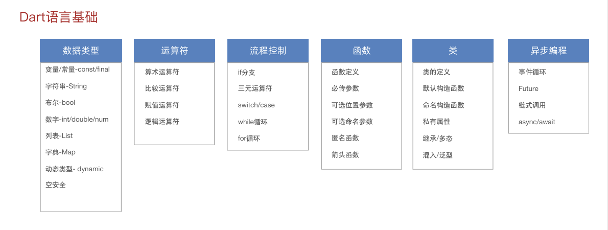
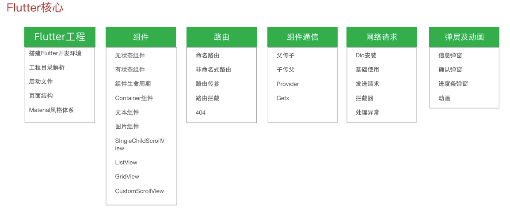

# Dart语言基础



- #### Dart的变量和常量

  - Dart中的变量声明-**var**

    *注意：使用var声明的变量，其类型在第一次赋值之后确定，不能再赋值其他类型的值*

  - Dart中的常量声明-**const**

    *const是代码**编译前**被确定，不允许表达式中有变量存在，必须为常量或者固定值*

  - Dart中的常量声明-**final**

    *final变量在**运行时**被初始化，其值设置后不可更改*

- #### Dart中的常用数据类型

  - **String**：引号支持双引号或者单引号，支持拼接及模板字符串；

    *String-模板字符串*

    语法：String 属性名 = ‘文本内容$变量名’; 或  **String 变量名 = ‘文本内容${变量名}’;**

    当存在模板中的内容是一个**表达式**的时候需要使用**${}**

  - **int/num/double**：int-整型数字，**num-可整型可小数**，double-小数

    数字之间的赋值关系 ：double和int不能直接赋值`可利用toInt()转化`，num不能直接给double赋值`可利用toDouble()转化`，double可直接给num赋值。

  - **bool**：true/false

  - **List**：当一个变量需要存储多个值的时候，可以使用列表类型List。

    常用操作方法和属性

    -   在尾部添加-add(内容) 
    - 在尾部添加一个列表-addAll(列表) 
    - 删除满足内容的第一个-remove(内容) 
    - 删除最后一个-removeLast() 
    - 删除索引范围内数据-removeRange(start,end)      `end不包含在删除范围内`
    -  循环-forEach((item) {});
    - 是否都满足条件-every((item) { return 布尔值  })；
    -  筛选出满足条件的数据-where((item) { return 布尔值 })；
    -  列表的长度(属性)-length 、最后一个元素(属性)-last 、第一个元素(属性)-first 、是否为空(属性)-isEmpty

  - **Map**：当存储的英文需要找到对应的中文描述，需要使用键值对类型Map；

    语法1：Map 属性名 =  { key: value };

    语法2： 字典[key] 可以取值和赋值

    常用操作方法 

    - 循环-forEach 
    - 在添加一个字典-addAll 
    -  是否包含某个key-containsKey 
    - 删除某个key-remove 
    - 清空-clear

  - **dynamic**：允许变量运行时**自由改变类型**, 同时绕过编译时的静态检查（*无编译检查，方法和属性直接调用*）

    语法：dynamic  属性名 = 值;

     dynamic和var的区别：var根据初始值进行推断类型，确定类型后类型确定，**有编译检查**，仅限推断的属性和方法

- #### Dart中的空安全机制

  在Dart语言中，通过编译静态检查将运行时空指针提前暴露，减少线上崩溃

  

- #### Dart的运算符

  

- #### Dart中的流程控制

  if分支语句、三元运算符、switch/case、循环语句

- #### Dart的函数

  返回值类型可省略，Dart会自动推断类型为dynamic

  - **函数的参数**
    - 必传参数：函数的参数分为必传参数，可选位置参数，可选命名参数
    - **可选位置参数**：可选位置参数必须位于必传参数后面, 采用中括号包裹：函数名(String a, **[ String? b, ... ]**)，传递时按照顺序传递
    - **可选命名参数**：可选命名参数必须位于必传参数后面, 采用大括号包裹；函数名(String a, **{ String? b, ...}**)，传递时按照`参数名:值`的方式进行传递，无需关注顺序
  - 匿名函数:可以声明一个没有名称的函数赋值给变量，进行调用
  - 箭头函数:当函数体只有一行代码时，可以使用箭头函数编写`函数名 () => 代码逻辑`

- #### **Dart中的类**

  定义类语法： **class**  Person  {  属性 方法   } 

  实例化对象： **Person  变量 =  Person();**

  

- #### Dart中异步编程——Future

  - 介绍：Future代表一个异步操作的最终结果. 
  - 状态：Uncompleted（等待）、Completed with a value (成功)、Completed with a error(失败) 
  - 创建：  Future(() {})  
  - 执行成功：不抛出异常-成功状态-then(() {}) 
  - 执行失败： throw Exception()-失败状态-catchError(() {})

- #### **Dart中异步编程-Future链式调用**

  - 介绍：Future可以通过链式的方式连续得到异步的结果 
  - 语法：通过Future().then() 拿到执行成功的结果 
  - 语法：通过Future().catchError() 拿到执行失败的结果 
  - 注意：在上一个then返回对象会在下一个then中接收 
  - 需求：执行三个异步任务，按照顺序排列，最后一次任务抛出异常

- #### Dart中异步编程-Future-async/await

  - 介绍：除了通过then/catchError的方式，还可以通过async/await来实现异步编程 

  - 特点:  await 总是等到后面的Future执行成功，才执行下方逻辑，async必须配套await出现 

  - 语法： 

    ```dart
     函数名 () async  {
         try { 
             await Future()； 
             // Future执行成功才执行的逻辑
         } catch(error) { 
             // 执行失败的逻辑 
         } 
     }
    ```

    

# Flutter组件核心

