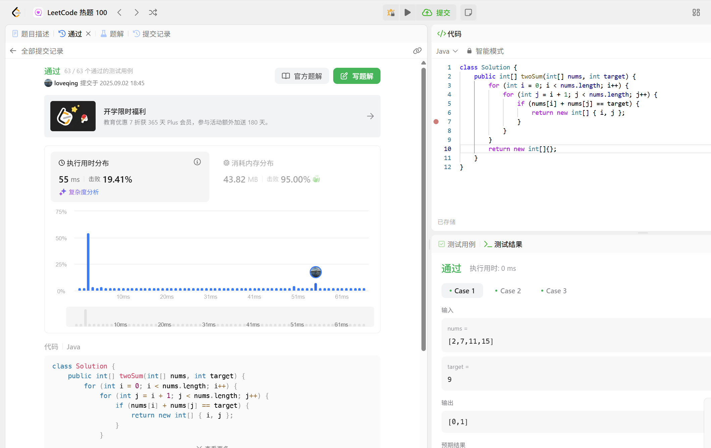
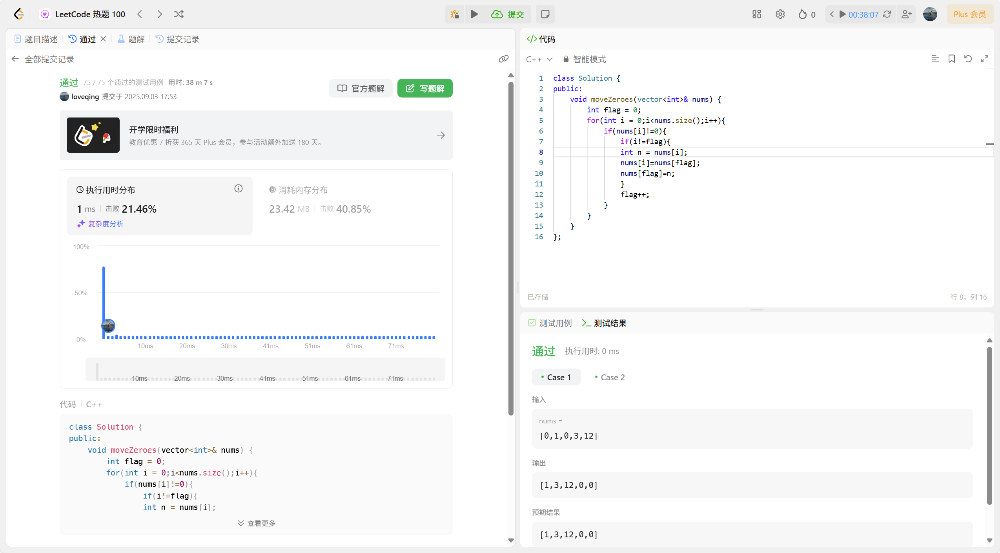
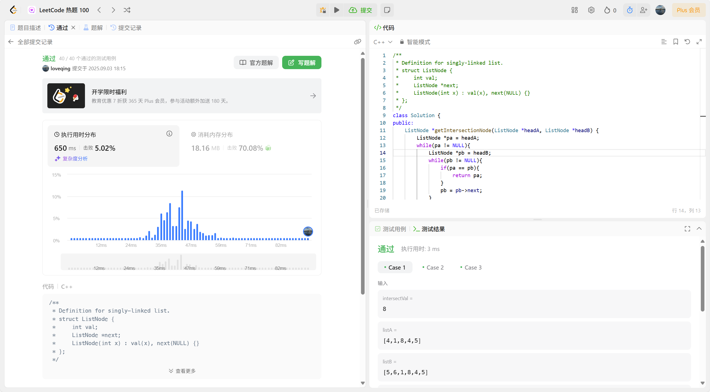
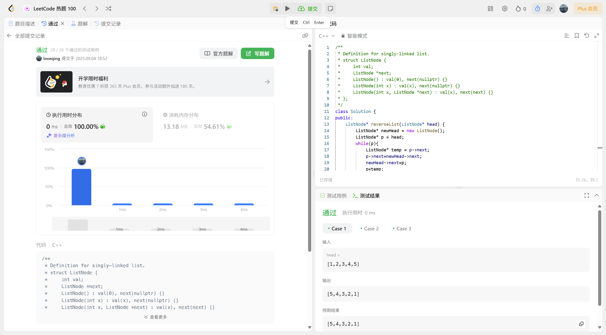
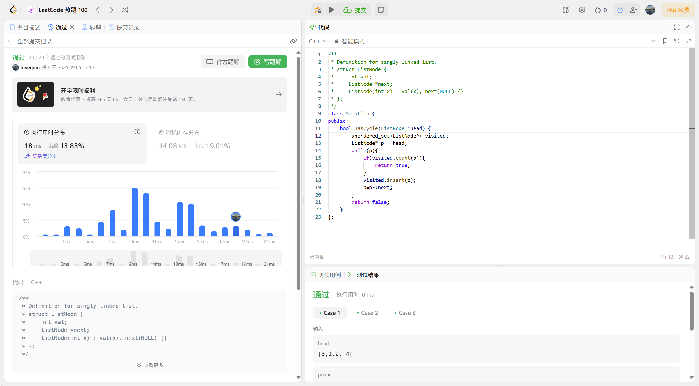
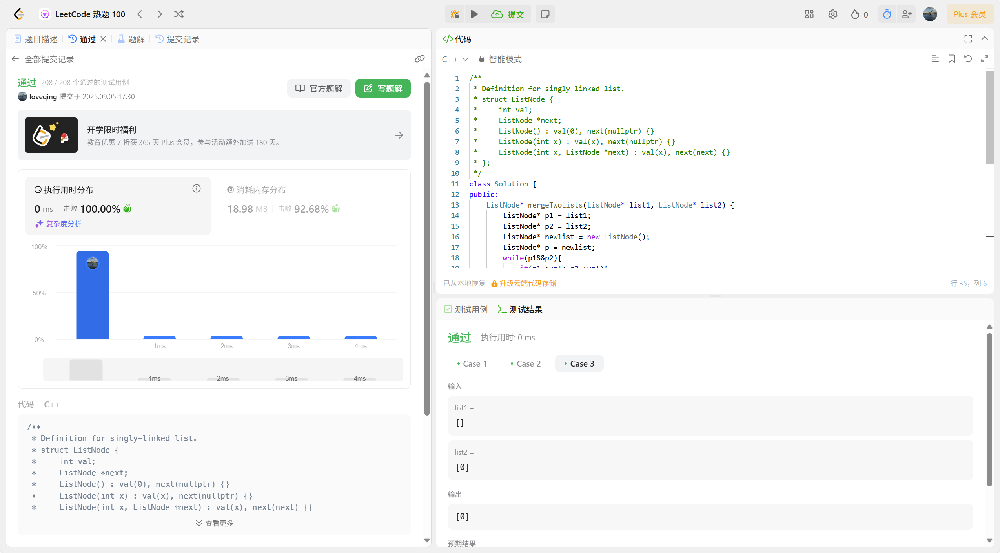

#### [1. 两数之和](https://leetcode.cn/problems/two-sum/)

思路：两个两的相加直到找出等于target的两个数，通过双层循环，第二层循环遍历第一层循环固定的那个数后面的数，分别与固定的数相加，直到试完所以组合。

```java
class Solution {

  public int[] twoSum(int[] nums, int target) {

​    for (int i = 0; i < nums.length; i++) {

​      for (int j = i + 1; j < nums.length; j++) {

​        if (nums[i] + nums[j] == target) {

​          return new int[] { i, j };

​        }

​      }

​    }

​    return new int[]{};

  }

}
```



#### [283. 移动零](https://leetcode.cn/problems/move-zeroes/)

思路：用flag标记非零元素应该放置的位置，i遍历整个数组，当i指针遇到非零元素时，交换i上的值和flag上的值，且flag标记前进一位。交换到i到达最后且flag标记过所有非零元素

```c++
class Solution {
public:
    void moveZeroes(vector<int>& nums) {
        int flag = 0;
        for(int i = 0;i<nums.size();i++){
            if(nums[i]!=0){
                if(i!=flag){
                int n = nums[i];
                nums[i]=nums[flag];
                nums[flag]=n;
                }
                flag++;
            }
        }
    }
};
```



#### [160. 相交链表](https://leetcode.cn/problems/intersection-of-two-linked-lists/)

思路：双重循环逐一比对两个链表的所有节点，第二次循环，指针pb每次重新指向头节点，直到找到第一个相同的节点（相同的地址）。

```c++
/**
 * Definition for singly-linked list.
 * struct ListNode {
 *     int val;
 *     ListNode *next;
 *     ListNode(int x) : val(x), next(NULL) {}
 * };
 */
class Solution {
public:
    ListNode *getIntersectionNode(ListNode *headA, ListNode *headB) {
        ListNode *pa = headA;
        while(pa != NULL){
            ListNode *pb = headB;
            while(pb != NULL){
                if(pa == pb){
                    return pa;
                }
                pb = pb->next;
            }
            pa = pa->next;
        }
        return NULL;
    }
};
```




#### [206. 反转链表](https://leetcode.cn/problems/reverse-linked-list/)

思路：用头插法反转链表，将原链表节点逐个移到新链表头部，实现顺序颠倒。

```c++
/**
 * Definition for singly-linked list.
 * struct ListNode {
 *     int val;
 *     ListNode *next;
 *     ListNode() : val(0), next(nullptr) {}
 *     ListNode(int x) : val(x), next(nullptr) {}
 *     ListNode(int x, ListNode *next) : val(x), next(next) {}
 * };
 */
class Solution {
public:
    ListNode* reverseList(ListNode* head) {
        ListNode* newHead = new ListNode();
        ListNode* p = head;
        while(p){
            ListNode* temp = p->next;
            p->next=newHead->next;
            newHead->next=p;
            p=temp;
        }
        ListNode* result = new ListNode();
        result= newHead->next;
        return result;
    }
};
```



#### [234. 回文链表](https://leetcode.cn/problems/palindrome-linked-list/)

思路：通过尾插法复制原链表得到相同顺序的副本，再用头插法反转该副本得到逆序链表，最后比较原链表与逆序链表是否一致来判断是否为回文。

```c++
/**
 * Definition for singly-linked list.
 * struct ListNode {
 *     int val;
 *     ListNode *next;
 *     ListNode() : val(0), next(nullptr) {}
 *     ListNode(int x) : val(x), next(nullptr) {}
 *     ListNode(int x, ListNode *next) : val(x), next(next) {}
 * };
 */
class Solution {
public:
    bool isPalindrome(ListNode* head) {
        ListNode* copyHead = new ListNode();
        ListNode* t = copyHead;
        ListNode* curr = head;
        //复制
        while (curr) {
            ListNode* newNode = new ListNode(curr->val);
            t->next = newNode; 
            t = t->next;
            curr = curr->next;
        }
        ListNode* reversedCopyHead = reverseList(copyHead);
        // 比较原链表和反转后的复制链表
        curr = head;
        while (curr&& reversedCopyHead) {
            if (curr->val != reversedCopyHead->val) {
                return false;
            }
            curr = curr->next;
            reversedCopyHead = reversedCopyHead->next;
        }
        return true;
    }
//反转复制的链表
    ListNode* reverseList(ListNode* head) {
        ListNode* newHead = new ListNode();
        ListNode* p = head;
        while (p) {
            ListNode* temp = p->next;
            p->next = newHead->next;
            newHead->next = p;
            p = temp;
        }
        ListNode* result = newHead->next;
        return result;
    }
};
```


#### [141. 环形链表](https://leetcode.cn/problems/linked-list-cycle/)

思路：用哈希集合记录已访问节点，从表头开始遍历：若当前节点在集合中，说明有环；若不在，则加入集合并继续遍历下一个节点。visited.count()用于检查集合中是否存在指定元素

```c++
/**
 * Definition for singly-linked list.
 * struct ListNode {
 *     int val;
 *     ListNode *next;
 *     ListNode(int x) : val(x), next(NULL) {}
 * };
 */
class Solution {
public:
    bool hasCycle(ListNode *head) {
        unordered_set<ListNode*> visited;
        ListNode* p = head;
        while(p){
            if(visited.count(p)){
                return true;
            }
            visited.insert(p);
            p=p->next;
        }
        return false;
    }
};
```



#### [21. 合并两个有序链表](https://leetcode.cn/problems/merge-two-sorted-lists/)

思路：`newlist`作为合并的新链表开头，用指针`p`构建新链表，`p1`、`p2`分别遍历两个输入链表。比较`p1`和`p2`指向的值，将较小节点接入新链表，同时移动对应指针，遍历结束后，因为输入链表是升序排列，所以直接将剩余链表接入新链表尾部

```c++
/**
 * Definition for singly-linked list.
 * struct ListNode {
 *     int val;
 *     ListNode *next;
 *     ListNode() : val(0), next(nullptr) {}
 *     ListNode(int x) : val(x), next(nullptr) {}
 *     ListNode(int x, ListNode *next) : val(x), next(next) {}
 * };
 */
class Solution {
public:
    ListNode* mergeTwoLists(ListNode* list1, ListNode* list2) {
        ListNode* p1 = list1;
        ListNode* p2 = list2;
        ListNode* newlist = new ListNode();
        ListNode* p = newlist;
        while(p1&&p2){
            if(p1->val<=p2->val){
                p->next = p1;
                p1=p1->next;
            }else{
                p->next = p2;
                p2=p2->next;
            }
            p=p->next;
        }
        if(p1){
            p->next = p1;
        }else{
            p->next=p2;
        }
        ListNode* result = newlist->next;
        return result;
    }
};
```


