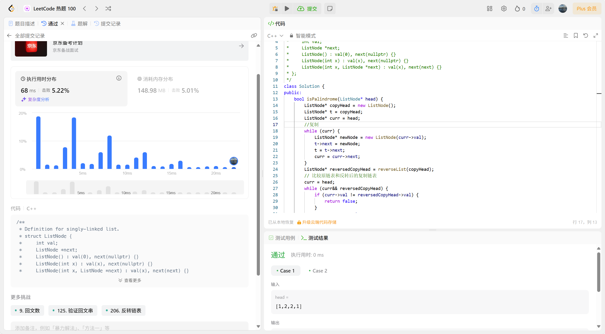

#### [1. 两数之和](https://leetcode.cn/problems/two-sum/)

思路：两个两的相加直到找出等于target的两个数，通过双层循环，第二层循环遍历第一层循环固定的那个数后面的数，分别与固定的数相加，直到试完所以组合。

```java
class Solution {

  public int[] twoSum(int[] nums, int target) {

​    for (int i = 0; i < nums.length; i++) {

​      for (int j = i + 1; j < nums.length; j++) {

​        if (nums[i] + nums[j] == target) {

​          return new int[] { i, j };

​        }

​      }

​    }

​    return new int[]{};

  }

}
```


#### [283. 移动零](https://leetcode.cn/problems/move-zeroes/)

思路：用flag标记非零元素应该放置的位置，i遍历整个数组，当i指针遇到非零元素时，交换i上的值和flag上的值，且flag标记前进一位。交换到i到达最后且flag标记过所有非零元素

```c++
class Solution {
public:
    void moveZeroes(vector<int>& nums) {
        int flag = 0;
        for(int i = 0;i<nums.size();i++){
            if(nums[i]!=0){
                if(i!=flag){
                int n = nums[i];
                nums[i]=nums[flag];
                nums[flag]=n;
                }
                flag++;
            }
        }
    }
};
```


#### [160. 相交链表](https://leetcode.cn/problems/intersection-of-two-linked-lists/)

思路：双重循环逐一比对两个链表的所有节点，第二次循环，指针pb每次重新指向头节点，直到找到第一个相同的节点（相同的地址）。

```c++
/**
 * Definition for singly-linked list.
 * struct ListNode {
 *     int val;
 *     ListNode *next;
 *     ListNode(int x) : val(x), next(NULL) {}
 * };
 */
class Solution {
public:
    ListNode *getIntersectionNode(ListNode *headA, ListNode *headB) {
        ListNode *pa = headA;
        while(pa != NULL){
            ListNode *pb = headB;
            while(pb != NULL){
                if(pa == pb){
                    return pa;
                }
                pb = pb->next;
            }
            pa = pa->next;
        }
        return NULL;
    }
};
```


#### [206. 反转链表](https://leetcode.cn/problems/reverse-linked-list/)

思路：用头插法反转链表，将原链表节点逐个移到新链表头部，实现顺序颠倒。

```c++
/**
 * Definition for singly-linked list.
 * struct ListNode {
 *     int val;
 *     ListNode *next;
 *     ListNode() : val(0), next(nullptr) {}
 *     ListNode(int x) : val(x), next(nullptr) {}
 *     ListNode(int x, ListNode *next) : val(x), next(next) {}
 * };
 */
class Solution {
public:
    ListNode* reverseList(ListNode* head) {
        ListNode* newHead = new ListNode();
        ListNode* p = head;
        while(p){
            ListNode* temp = p->next;
            p->next=newHead->next;
            newHead->next=p;
            p=temp;
        }
        ListNode* result = new ListNode();
        result= newHead->next;
        return result;
    }
};
```


#### [234. 回文链表](https://leetcode.cn/problems/palindrome-linked-list/)

思路：通过尾插法复制原链表得到相同顺序的副本，再用头插法反转该副本得到逆序链表，最后比较原链表与逆序链表是否一致来判断是否为回文。

```c++
/**
 * Definition for singly-linked list.
 * struct ListNode {
 *     int val;
 *     ListNode *next;
 *     ListNode() : val(0), next(nullptr) {}
 *     ListNode(int x) : val(x), next(nullptr) {}
 *     ListNode(int x, ListNode *next) : val(x), next(next) {}
 * };
 */
class Solution {
public:
    bool isPalindrome(ListNode* head) {
        ListNode* copyHead = new ListNode();
        ListNode* t = copyHead;
        ListNode* curr = head;
        //复制
        while (curr) {
            ListNode* newNode = new ListNode(curr->val);
            t->next = newNode; 
            t = t->next;
            curr = curr->next;
        }
        ListNode* reversedCopyHead = reverseList(copyHead);
        // 比较原链表和反转后的复制链表
        curr = head;
        while (curr&& reversedCopyHead) {
            if (curr->val != reversedCopyHead->val) {
                return false;
            }
            curr = curr->next;
            reversedCopyHead = reversedCopyHead->next;
        }
        return true;
    }
//反转复制的链表
    ListNode* reverseList(ListNode* head) {
        ListNode* newHead = new ListNode();
        ListNode* p = head;
        while (p) {
            ListNode* temp = p->next;
            p->next = newHead->next;
            newHead->next = p;
            p = temp;
        }
        ListNode* result = newHead->next;
        return result;
    }
};
```



#### [141. 环形链表](https://leetcode.cn/problems/linked-list-cycle/)

思路：用哈希集合记录已访问节点，从表头开始遍历：若当前节点在集合中，说明有环；若不在，则加入集合并继续遍历下一个节点。visited.count()用于检查集合中是否存在指定元素

```c++
/**
 * Definition for singly-linked list.
 * struct ListNode {
 *     int val;
 *     ListNode *next;
 *     ListNode(int x) : val(x), next(NULL) {}
 * };
 */
class Solution {
public:
    bool hasCycle(ListNode *head) {
        unordered_set<ListNode*> visited;
        ListNode* p = head;
        while(p){
            if(visited.count(p)){
                return true;
            }
            visited.insert(p);
            p=p->next;
        }
        return false;
    }
};
```


#### [21. 合并两个有序链表](https://leetcode.cn/problems/merge-two-sorted-lists/)

思路：`newlist`作为合并的新链表开头，用指针`p`构建新链表，`p1`、`p2`分别遍历两个输入链表。比较`p1`和`p2`指向的值，将较小节点接入新链表，同时移动对应指针，遍历结束后，因为输入链表是升序排列，所以直接将剩余链表接入新链表尾部

```c++
/**
 * Definition for singly-linked list.
 * struct ListNode {
 *     int val;
 *     ListNode *next;
 *     ListNode() : val(0), next(nullptr) {}
 *     ListNode(int x) : val(x), next(nullptr) {}
 *     ListNode(int x, ListNode *next) : val(x), next(next) {}
 * };
 */
class Solution {
public:
    ListNode* mergeTwoLists(ListNode* list1, ListNode* list2) {
        ListNode* p1 = list1;
        ListNode* p2 = list2;
        ListNode* newlist = new ListNode();
        ListNode* p = newlist;
        while(p1&&p2){
            if(p1->val<=p2->val){
                p->next = p1;
                p1=p1->next;
            }else{
                p->next = p2;
                p2=p2->next;
            }
            p=p->next;
        }
        if(p1){
            p->next = p1;
        }else{
            p->next=p2;
        }
        ListNode* result = newlist->next;
        return result;
    }
};
```


#### [94. 二叉树的中序遍历](https://leetcode.cn/problems/binary-tree-inorder-traversal/)

思路：采用递归方式实现中序遍历，按照左子树 、根节点 、右子树（中序遍历规则）访问节点，通过**引用传递**节点的值，直到为空节点。

```c++
/**
 * Definition for a binary tree node.
 * struct TreeNode {
 *     int val;
 *     TreeNode *left;
 *     TreeNode *right;
 *     TreeNode() : val(0), left(nullptr), right(nullptr) {}
 *     TreeNode(int x) : val(x), left(nullptr), right(nullptr) {}
 *     TreeNode(int x, TreeNode *left, TreeNode *right) : val(x), left(left), right(right) {}
 * };
 */
class Solution {
public:
    vector<int> inorderTraversal(TreeNode* root) {
        vector<int> reslut;
        traversal(root,reslut);
        return reslut;
    }
    void traversal(TreeNode* node,vector<int>& val){
        if(node==nullptr)
        return;
        traversal(node->left,val);
        val.push_back(node->val);
        traversal(node->right,val);
    }
};
```


#### [104. 二叉树的最大深度](https://leetcode.cn/problems/maximum-depth-of-binary-tree/)

思路：使用深度优先搜索计算二叉树最大深度。以空节点深度为 0 作为终止条件，递归计算当前节点左右子树的最大深度，取两者中的最大值加 1（计入当前节点），即为当前节点所在子树的最大深度。从**叶子节点**逐层向上叠加，最终得到整棵树的最大深度。

```c++
/**
 * Definition for a binary tree node.
 * struct TreeNode {
 *     int val;
 *     TreeNode *left;
 *     TreeNode *right;
 *     TreeNode() : val(0), left(nullptr), right(nullptr) {}
 *     TreeNode(int x) : val(x), left(nullptr), right(nullptr) {}
 *     TreeNode(int x, TreeNode *left, TreeNode *right) : val(x), left(left), right(right) {}
 * };
 */
class Solution {
public:
    int maxDepth(TreeNode* root) {
        if(root == nullptr)
        return 0;
        int leftDepth = maxDepth(root->left);
        int rightDepth = maxDepth(root->right);
        return max(leftDepth,rightDepth)+1;
    }
};
```


#### [226. 翻转二叉树](https://leetcode.cn/problems/invert-binary-tree/)

思路：采用**递归**思路，先判断当前节点是否为空，若为空则直接返回；否则递归翻转当前节点的左子树和右子树，然后交换当前节点的左右子树指针，最终返回处理后的当前节点，从而实现整棵二叉树的翻转。

```c++
/**
 * Definition for a binary tree node.
 * struct TreeNode {
 *     int val;
 *     TreeNode *left;
 *     TreeNode *right;
 *     TreeNode() : val(0), left(nullptr), right(nullptr) {}
 *     TreeNode(int x) : val(x), left(nullptr), right(nullptr) {}
 *     TreeNode(int x, TreeNode *left, TreeNode *right) : val(x), left(left), right(right) {}
 * };
 */
class Solution {
public:
    TreeNode* invertTree(TreeNode* root) {
        if(root == nullptr){
            return nullptr;
        }
        TreeNode* left = invertTree(root->left);
        TreeNode* right = invertTree(root->right);
        root->left = right;
        root->right = left;
        return root;
    }
};
```


#### [101. 对称二叉树](https://leetcode.cn/problems/symmetric-tree/)

思路：还是通过递归，先检查根节点是否为空（空树视为对称），否则调用symmetric函数比较左右子树；辅助函数先判断两节点是否都为空（对称）或仅有一个为空（不对称），再比较节点值是否相等，最后递归比较左节点的左子树与右节点的右子树、左节点的右子树与右节点的左子树，只有所有对应位置都满足条件才返回对称。

```c++
/**
 * Definition for a binary tree node.
 * struct TreeNode {
 *     int val;
 *     TreeNode *left;
 *     TreeNode *right;
 *     TreeNode() : val(0), left(nullptr), right(nullptr) {}
 *     TreeNode(int x) : val(x), left(nullptr), right(nullptr) {}
 *     TreeNode(int x, TreeNode *left, TreeNode *right) : val(x), left(left), right(right) {}
 * };
 */
class Solution {
public:
    bool isSymmetric(TreeNode* root) {
        if(root == nullptr)
        return true;
        return symmetric(root->left,root->right);
    }
    bool symmetric(TreeNode* left,TreeNode* right){
        if(!left && !right)
        return true;
        if(!left || !right)
        return false;
        if(left->val != right->val){
            return false;
        }
        return symmetric(left->left,right->right)&&symmetric(left->right,right->left);
    }
};
```


#### [543. 二叉树的直径](https://leetcode.cn/problems/diameter-of-binary-tree/)

思路：遍历所有节点，算出每个节点的 "左段长度 + 右段长度"，其中最大的那个值就是整个树的直径。通过递归的方式，一边计算每个节点往下能伸多远（深度），一边把左右两段加起来和当前最大直径比一比，更新最大的那个值。

```c++
/**
 * Definition for a binary tree node.
 * struct TreeNode {
 *     int val;
 *     TreeNode *left;
 *     TreeNode *right;
 *     TreeNode() : val(0), left(nullptr), right(nullptr) {}
 *     TreeNode(int x) : val(x), left(nullptr), right(nullptr) {}
 *     TreeNode(int x, TreeNode *left, TreeNode *right) : val(x), left(left), right(right) {}
 * };
 */
class Solution {
    int maxDiameter = 0;
    int depth(TreeNode* root) {
        if(root == nullptr) return 0;
        
        int leftDepth = depth(root->left);
        int rightDepth = depth(root->right);
        maxDiameter = max(maxDiameter, leftDepth + rightDepth);
        return max(leftDepth, rightDepth) + 1;
    }
    
public:
    int diameterOfBinaryTree(TreeNode* root) {
        if(root == nullptr) return 0;
        depth(root);
        return maxDiameter;
    }
};
```


#### [108. 将有序数组转换为二叉搜索树](https://leetcode.cn/problems/convert-sorted-array-to-binary-search-tree/)

思路：以**二分法**选取数组中间元素作为当前子树的根节点（保证左右子树平衡），再**递归**地用同样方法将中间元素左侧数组构建为左子树、右侧数组构建为右子树，最终形成满足 “左小右大” 特性且左右高度差不超过 1 的平衡二叉搜索树。

```c++
/**
 * Definition for a binary tree node.
 * struct TreeNode {
 *     int val;
 *     TreeNode *left;
 *     TreeNode *right;
 *     TreeNode() : val(0), left(nullptr), right(nullptr) {}
 *     TreeNode(int x) : val(x), left(nullptr), right(nullptr) {}
 *     TreeNode(int x, TreeNode *left, TreeNode *right) : val(x), left(left), right(right) {}
 * };
 */
class Solution {
public:
    TreeNode* traversal(vector<int>& nums, int left, int right) {
        if (left > right) {
            return nullptr;
        }
        int mid = left + (right - left)/2;
        TreeNode* root = new TreeNode(nums[mid]);
        root->left = traversal(nums, left, mid - 1);
        root->right = traversal(nums, mid + 1, right);
        return root;
    }
    TreeNode* sortedArrayToBST(vector<int>& nums) {
        return traversal(nums, 0, nums.size() - 1);
    }
};
```


#### [35. 搜索插入位置](https://leetcode.cn/problems/search-insert-position/)

思路：通过二分查找：先用左右指针分别指向数组的起始和末尾，然后在左右指针未交叉（left ≤ right）的循环中，不断计算中间位置 mid，将数组中间元素与目标值对比： 若中间元素小于目标值，说明目标值在 mid 右侧，将 left 移至 mid+1；若中间元素大于等于目标值，说明目标值在 mid 左侧或就是 mid，将 right 移至 mid-1。当循环结束时，left 指针恰好停在**第一个大于等于目标值的位置**，这个位置就是目标值插入后能保持数组有序的正确位置，直接返回 left 即可。

```c++
class Solution {
public:
    int searchInsert(vector<int>& nums, int target) {
    int left=0,right=nums.size()-1;
    while(left<=right){
        int mid=(left+right)/2;
        if(nums[mid]<target){
            left=mid+1;
        }else{
            right=mid-1;
        }
    }
    return left;
    }
};
```


#### [20. 有效的括号](https://leetcode.cn/problems/valid-parentheses/)

思路：用栈来匹配括号：遍历字符串时，遇到左括号（'(', '[', '{'）就暂时存到栈里；遇到右括号时，就检查栈顶是否有对应的左括号（比如 ')' 对应 '(', '}' 对应 '{'），如果没有对应左括号或栈为空（没左括号可匹配），就说明无效；如果匹配上了，就把栈顶的左括号移除。最后如果栈空了，说明所有括号都正确配对，返回有效；否则无效。

```c++
class Solution {
public:
    bool isValid(string s) {
      stack<int> p;
      for (int i = 0; i < s.size(); i++) {
        if (s[i] == '(' || s[i] == '[' || s[i] == '{') p.push(i);
        else {
          if (p.empty()) return false;
          if (s[i] == ')' && s[p.top()] != '(') return false;
          if (s[i] == '}' && s[p.top()] != '{') return false;
          if (s[i] == ']' && s[p.top()] != '[') return false;
          p.pop();
        }
      }
      return p.empty();
    }
};
```


